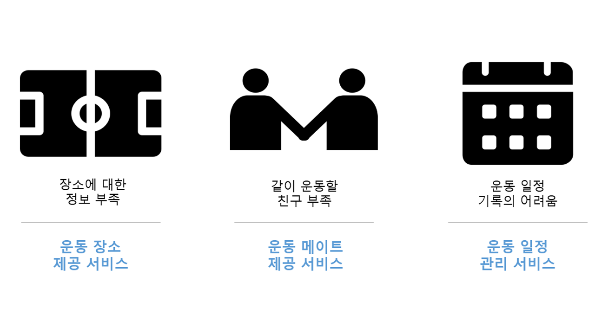

# 운동할 메이트와 장소를 같이 찾아요!

## 👭팀원 소개

##### 조영현 (Yeonghyeon Jo)

- **총괄 팀장, 프론트 엔드, Vue 개발**
- 🍎 Github : https://github.com/doyosaedog

##### 정재호 ( Jaeho Jeong )

- **프론트 엔드, Vue 개발**
- 🍋 Github : https://github.com/jaho901

##### 조해성 (Haesung Cho)

- **프론트 엔드, Vue 개발**
- 🍌 Github : https://github.com/daedaem

##### 김현민 (Hyunmin Kim)

- **백엔드, SpringBoot 개발**
- 🍇 Github : https://github.com/hyunmin2439

##### 배소원 (Sowon Bae)

- **백엔드, SpringBoot 개발**
- 🍓 Github : https://github.com/SowonBae

##### 임창현 (Changhyeon Lim)

- **백엔드, SpringBoot 개발**
- 🍑 Github : https://github.com/ckdgus777

## 프로젝트 개요

       

- 운동 카테고리별 자신의 거주지와 가까운 운동장 및 체육관의 정보를 알려주고 예약을 할 수 있는 기능을 제공한다.

- 혼자하는 운동이 아닌 다양한 사람과의 만남을 통해 흥미를 가지고 함께 할 수 있는 운동을 제공한다.

  

#### 프로젝트 관련 사이트

---

##### [기능 명세서](https://docs.google.com/spreadsheets/d/1kfCWI3TbXJp1Jj8yONFbBbaU0l_I9F6j67QyKznPYfg/edit#gid=0)

##### [마인드맵](https://www.mindmeister.com/map/2250153434)

##### [팀 노션](https://www.notion.so/201826888/2fbf3ac7c3c240cd934527d143c50d0e)

##### [와이어프레임](https://www.figma.com/file/H1SQuE4vjwrjhhhonxnxa6/%EC%9E%90%EC%9C%A8-%ED%94%84%EB%A1%9C%EC%A0%9D%ED%8A%B8?node-id=0%3A1)

##### [ERD](https://www.erdcloud.com/d/PdrjSfBm9oB4e4rur)

##### [GitLab](https://lab.ssafy.com/s06-final/S06P31E205)

##### [Jira](https://jira.ssafy.com/projects/S06P31E205?selectedItem=com.atlassian.jira.jira-projects-plugin:report-page)

---

### 기획 의도

---

####  ‘체육활동을 위한 **장소**와 **사람**을 중개함으로써, 국민생활체육 활동 증진 도모하는 **운동 중개 플랫폼**’

- 2021년, 문체부 국민생활체육조사에 따르면 생활체육 참여율 50%로 부족. -> **'국민의 생활체육 참여 부족'**

- 체육시설 비이용 이유 2위, 12.4% '체육시설에 대한 정보가 없어서' -> **'운동 장소 정보 부족'**

- 체육 동호회 조직 가입 이유 1위, 59.4% '여러 사람들과 어울려서 운동하고 싶어서' -> '**운동을 함께 할 사람 필요'**

## 프로젝트 소개

#### 주요 서비스

##### 1. 운동 장소

- 메인 페이지에서 장소 참가하기 버튼을 누르거나 상단의 장소를 누르게 되면 장소 페이지로 넘어갑니다.
- 
- 기본적으로 2차 정보로 입력된 주소지를 기준으로 장소 정보를 제공하는데, 필터링을 통해 지역이나 운동종목별로 다른 결과를 확인할 수 있습니다.
- 검색 기능도 지원합니다.
- 장소 목록에서 해당 운동시설이 마음에 든다면 하트를 눌러 좋아요/찜하기 표시를 할 수 있습니다.
- 장소 목록과 지도를 확인한 후 왼쪽의 장소를 클릭하게 되면 장소 상세 페이지로 넘어갑니다.
- 상세 페이지에서 리뷰를 포함한 여러가지 정보들을 확인한 후, 날짜와 시간을 선택해 예약을 할 수 있습니다.
- 예약은 아임포트 API를 활용하여 실제 결제가 가능하도록 되어있으나, 매일 자정을 기준으로 환불이 되고있으니 결제 테스트를 진행해도 됩니다.

##### 2. 운동 메이트

- 개인끼리 또는 집단끼리 원하는 날짜, 시간과 원하는 장소에서 함께 만나 운동을 할 수 있는 기능을 제공한다.
- 메인 페이지에서 메이트 참가하기 버튼을 누르거나 상단의 메이트를 누르게 되면 메이트 페이지로 넘어갑니다.
- 로그인 된 유저라면 메이트 모집공고 등록 또는 메이트 모집글을 보고 신청하기 또는 좋아요 표시하기가 가능합니다.
- 기본적으로 2차 정보로 입력된 주소지를 기준으로 메이트 정보를 제공하는데, 필터링을 통해 지역이나 운동종목별로 다른 결과를 확인할 수 있습니다.
- 검색 기능도 지원합니다. 

##### 3. 프로필

- 메인 페이지에서 상단의 프로필을 누르게 되면 프로필 페이지로 이동할 수 있습니다.
- 자신의 프로필 페이지라면 한 줄 소개나 정보, 비밀번호 등을 수정할 수 있습니다.
- 좋아요 표시한 장소와 메이트글 목록을 확인할 수 있습니다.
- 예약 완료된 장소의 목록을 확인할 수 있습니다.
- 과거에 예약을 해서 운동을 진행했거나, 지금 예약이 되어있는 경우 잔디모양의 스케줄 표를 통해 얼마나 자주 운동했는지를 확인할 수 있습니다.
- 받은 메이트 신청 또는 보낸 메이트 신청 목록을 확인할 수 있습니다.

#### 기능 소개

##### 1. 카카오 로그인

##### 2. 메인 페이지

##### 3. 장소 페이지

##### 4. 메이트 페이지

##### 5. 프로필 페이지

