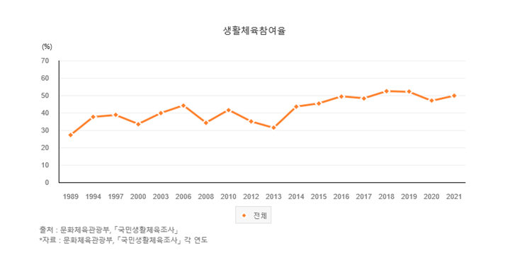
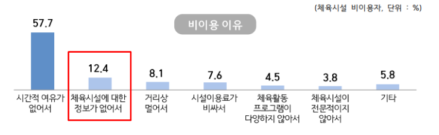
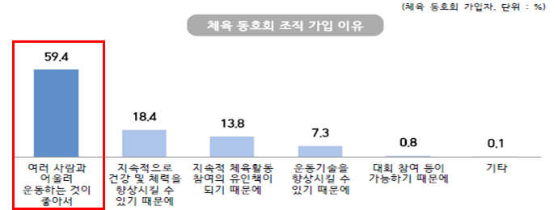
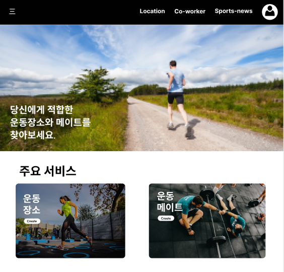
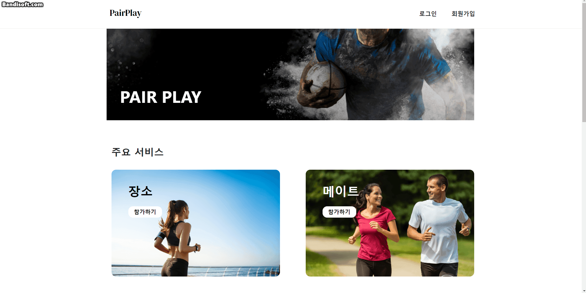
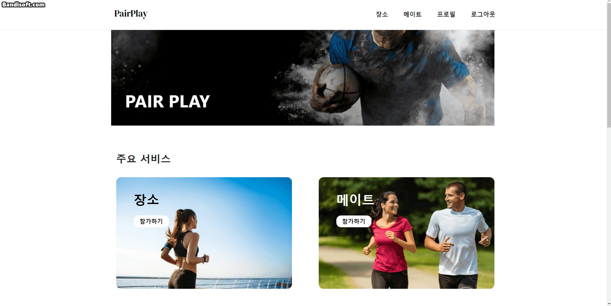
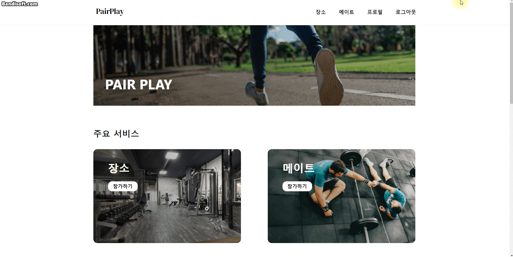

# 운동할 메이트와 장소를 같이 찾아요!

## 👭팀원 소개

##### 조영현 (Yeonghyeon Jo)

- **총괄 팀장, 프론트 엔드, Vue 개발**
- 🍎 Github : https://github.com/doyosaedog

##### 정재호 ( Jaeho Jeong )

- **프론트 엔드, Vue 개발**
- 🍋 Github : https://github.com/jaho901

##### 조해성 (Haesung Cho)

- **프론트 엔드, Vue 개발**
- 🍌 Github : https://github.com/daedaem

##### 김현민 (Hyunmin Kim)

- **백엔드, SpringBoot 개발**
- 🍇 Github : https://github.com/hyunmin2439

##### 배소원 (Sowon Bae)

- **백엔드, SpringBoot 개발**
- 🍓 Github : https://github.com/SowonBae

##### 임창현 (Changhyeon Lim)

- **백엔드, SpringBoot 개발**
- 🍑 Github : https://github.com/ckdgus777

## 프로젝트 개요

       

- 운동 카테고리별 자신의 거주지와 가까운 운동장 및 체육관의 정보를 알려주고 예약을 할 수 있는 기능을 제공한다.
- 혼자하는 운동이 아닌 다양한 사람과의 만남을 통해 흥미를 가지고 함께 할 수 있는 운동을 제공한다.
- 일시적인 만남뿐만 아니라 한 집단에 소속되어 원하는 운동을 할 수 있는 기능을 제공한다.

#### 프로젝트 관련 사이트

---

##### [기능 명세서](https://docs.google.com/spreadsheets/d/1kfCWI3TbXJp1Jj8yONFbBbaU0l_I9F6j67QyKznPYfg/edit#gid=0)

##### [마인드맵](https://www.mindmeister.com/map/2250153434)

##### [팀 노션](https://www.notion.so/201826888/2fbf3ac7c3c240cd934527d143c50d0e)

##### [와이어프레임](https://www.figma.com/file/H1SQuE4vjwrjhhhonxnxa6/%EC%9E%90%EC%9C%A8-%ED%94%84%EB%A1%9C%EC%A0%9D%ED%8A%B8?node-id=0%3A1)

##### [ERD](https://www.erdcloud.com/d/PdrjSfBm9oB4e4rur)

##### [GitLab](https://lab.ssafy.com/s06-final/S06P31E205)

##### [Jira](https://jira.ssafy.com/projects/S06P31E205?selectedItem=com.atlassian.jira.jira-projects-plugin:report-page)

---

### 기획 의도

---

문화체육관광부에서 제공하는 국민생활체육조사 자료에 따르면 국민의 생활체육 참여율이 점진적으로 증가하고 있음을 확인할 수 있다.

하지만 아직도 여전히 국민의 50% 정도는 생활체육에 참여하고있지 않다는 것을 알 수 있다.

우리는 이 원인이 무엇일지 조사해 보았고

시간적 여유가 없거나, 체육시설에 대한 정보가 없어서 참여하지 않는다는 조사결과를 확인할 수 있었고,

이 중 체육시설에 대한 정보 부족을 해결해주고자 서비스를 기획하게 되었으며,

더 즐겁고 꾸준하게 체육활동을 이어나가기 위한 조건인 '여러사람과 어울려 운동하는 것' 을 충족시켜주기위해 

같이 운동할 사람을 찾아주는 기능도 제공하는 서비스를 기획하였다.

## 프로젝트 소개

#### 주요 서비스

##### 1. 운동 장소

- 원하는 주소에 존재하는 운동 장소를 제공한다.
- 원하는 운동 장소의 예약 기능을 통해 원하는 시간에 이용이 가능하다.

##### 2. 운동 메이트

- 개인끼리 또는 집단끼리 원하는 날짜, 시간과 원하는 장소에서 함께 만나 운동을 할 수 있는 기능을 제공한다.
- 소속감을 가지고 운동을 하고 싶은 사람들에게 집단을 소개해주고 연결해주는 기능을 제공한다.
- 자신이 집단을 생성해 원하는 사람들을 통솔하며 운동을 진행할 수 있다.

#### 서비스 소개

##### 1. 회원가입 및 로그인

- 이메일 형식에 따른 아이디로 가입이 가능하며 아이디와 닉네임 모두 중복확인을 해야 가입이 가능합니다.
- 비밀번호와 비밀번호확인에 다르게 입력하면 회원가입이 진행되지 않습니다.
- 1차 정보를 모두 입력하고 **다음으로** 버튼을 누르면 2차 정보 입력페이지로 이동합니다.
- 2차 정보는 필수 입력은 아니나, 입력하지 않을 경우 사이트 이용에 제약이 생길 수 있습니다.

- 로그인 시에 구글 또는 카카오 아이디로 로그인할 수 있으며, 필요에 따라 2차 정보를 입력받을 수 있습니다.

##### 2. 메이트

- 메인 페이지에서 메이트 참가하기 버튼을 누르거나 상단의 메이트를 누르게 되면 메이트 페이지로 넘어갑니다.
- 로그인 된 유저라면 메이트 모집공고 등록 또는 메이트 모집글을 보고 신청하기 또는 좋아요 표시하기가 가능합니다.
- 기본적으로 2차 정보로 입력된 주소지를 기준으로 메이트 정보를 제공하는데, 필터링을 통해 지역이나 운동종목별로 다른 결과를 확인할 수 있습니다.
- 검색 기능도 지원합니다. 

##### 3. 장소

- 메인 페이지에서 장소 참가하기 버튼을 누르거나 상단의 장소를 누르게 되면 장소 페이지로 넘어갑니다.
- 기본적으로 2차 정보로 입력된 주소지를 기준으로 장소 정보를 제공하는데, 필터링을 통해 지역이나 운동종목별로 다른 결과를 확인할 수 있습니다.
- 검색 기능도 지원합니다.
- 장소 목록에서 해당 운동시설이 마음에 든다면 하트를 눌러 좋아요/찜하기 표시를 할 수 있습니다.
- 장소 목록과 지도를 확인한 후 왼쪽의 장소를 클릭하게 되면 장소 상세 페이지로 넘어갑니다.
- 상세 페이지에서 리뷰를 포함한 여러가지 정보들을 확인한 후, 날짜와 시간을 선택해 예약을 할 수 있습니다.
- 예약은 아임포트 API를 활용하여 실제 결제가 가능하도록 되어있으나, 매일 자정을 기준으로 환불이 되고있으니 결제 테스트를 진행해도 됩니다.

##### 4. 프로필

- 메인 페이지에서 상단의 프로필을 누르게 되면 프로필 페이지로 이동할 수 있습니다.
- 자신의 프로필 페이지라면 한 줄 소개나 정보, 비밀번호 등을 수정할 수 있습니다.
- 좋아요 표시한 장소와 메이트글 목록을 확인할 수 있습니다.
- 예약 완료된 장소의 목록을 확인할 수 있습니다.
- 과거에 예약을 해서 운동을 진행했거나, 지금 예약이 되어있는 경우 잔디모양의 스케줄 표를 통해 얼마나 자주 운동했는지를 확인할 수 있습니다.
- 받은 메이트 신청 또는 보낸 메이트 신청 목록을 확인할 수 있습니다.