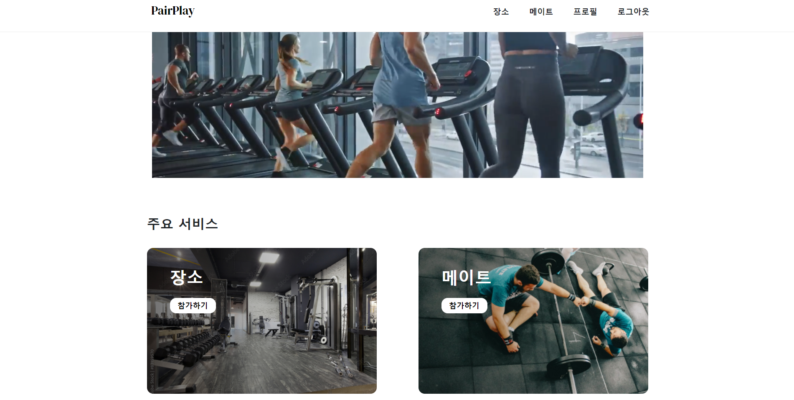
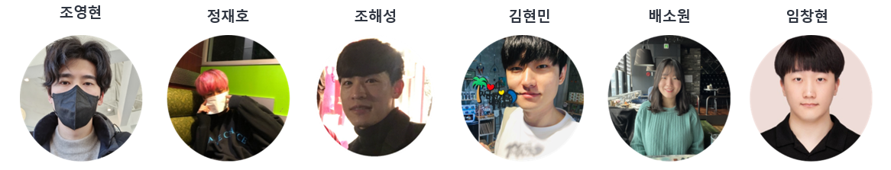
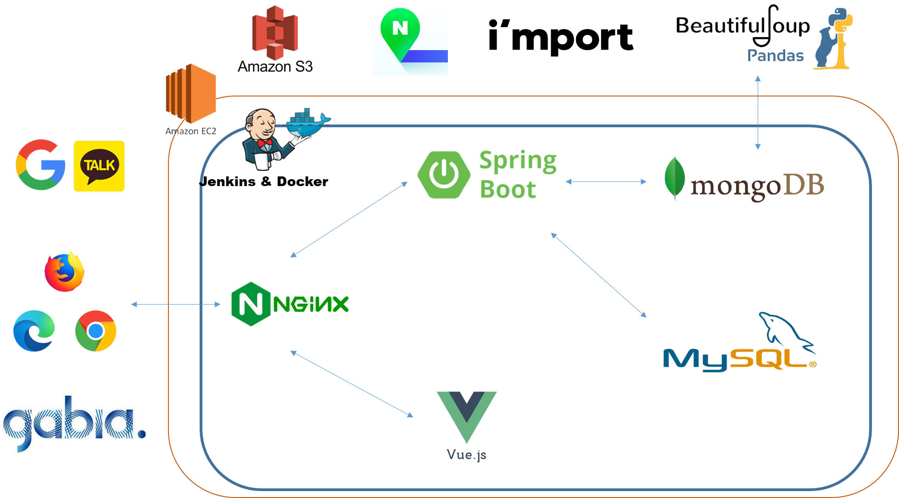
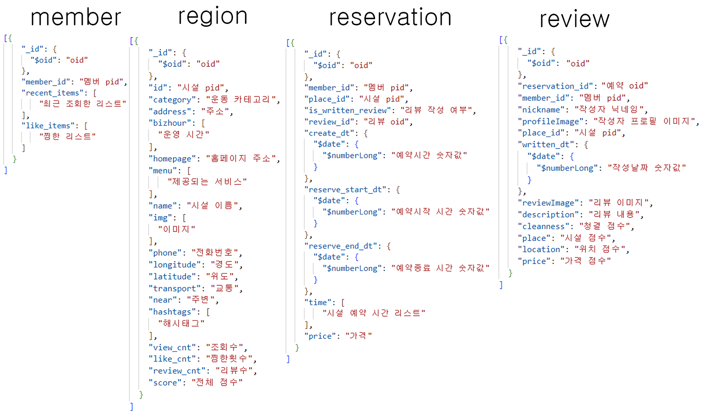

# PairPlay - 운동할 메이트와 장소를 같이 찾아요!
## 프로젝트 개요
- 운동 카테고리별 자신의 거주지와 가까운 운동장 및 체육관의 정보를 알려주고 예약을 할 수 있는 기능을 제공

- 혼자하는 운동이 아닌 다양한 사람과의 만남을 통해 흥미를 가지고 함께 할 수 있는 운동을 제공
  

  

## 👭팀원 소개

##### 조영현 (Yeonghyeon Jo)

- **총괄 팀장 / 프론트 엔드**
- 🍎 Github : https://github.com/doyosaedog

##### 정재호 ( Jaeho Jeong )

- **프론트 엔드**
- 🍋 Github : https://github.com/jaho901

##### 조해성 (Haesung Cho)

- **프론트 엔드**
- 🍌 Github : https://github.com/daedaem

##### 김현민 (Hyunmin Kim)

- **백엔드**
- 🍇 Github : https://github.com/hyunmin2439

##### 배소원 (Sowon Bae)

- **백엔드**
- 🍓 Github : https://github.com/SowonBae

##### 임창현 (Changhyeon Lim)

- **백엔드**
- 🍑 Github : https://github.com/ckdgus777

  

## 프로젝트 설계 링크
##### [기능 명세서](https://docs.google.com/spreadsheets/d/1kfCWI3TbXJp1Jj8yONFbBbaU0l_I9F6j67QyKznPYfg/edit#gid=0)

##### [마인드맵](https://www.mindmeister.com/map/2250153434)

##### [팀 노션](https://www.notion.so/201826888/2fbf3ac7c3c240cd934527d143c50d0e)

##### [와이어프레임](https://www.figma.com/file/H1SQuE4vjwrjhhhonxnxa6/%EC%9E%90%EC%9C%A8-%ED%94%84%EB%A1%9C%EC%A0%9D%ED%8A%B8?node-id=0%3A1)

##### [ERD](https://www.erdcloud.com/d/PdrjSfBm9oB4e4rur)

##### [GitLab](https://lab.ssafy.com/s06-final/S06P31E205)

##### [Jira](https://jira.ssafy.com/projects/S06P31E205?selectedItem=com.atlassian.jira.jira-projects-plugin:report-page)

  

## 기획 의도
####  ‘체육활동을 위한 **장소**와 **사람**을 중개함으로써, 국민생활체육 활동 증진 도모하는 **운동 중개 플랫폼**’

- 2021년, 문체부 국민생활체육조사에 따르면 생활체육 참여율 50%로 부족. -> **'국민의 생활체육 참여 부족'**

- 체육시설 비이용 이유 2위, 12.4% '체육시설에 대한 정보가 없어서' -> **'운동 장소 정보 부족'**

- 체육 동호회 조직 가입 이유 1위, 59.4% '여러 사람들과 어울려서 운동하고 싶어서' -> '**운동을 함께 할 사람 필요'**

  

## 프로젝트 특장점 및 차별점

### 특장점

- 운동 스케줄 기록을 관리하여 이용자에게 동기부여
- 네이버 지도 API를 통해 위치 기반 체육 시설 정보 제공
- i`m port 결제 대행 API를 통한 실제 결제 시스템을 연동

### 차별점
   - 타 플랫폼들은 사람 또는 장소에 단일화된 서비스를 제공 하지만, PairPlay는 ***사람과 장소를 모두 중개***하는 플랫폼

  

## 기술 스택
       

  

## 프로젝트 아키텍처

  

## DB 설계
### My SQL

### MongoDB

  

## 주요 서비스

### 1. 운동 장소
- 운동 카테고리별 검색을 통해 원하는 운동 시설을 조회하고 예약할 수 있는 서비스를 제공

### 2. 운동 메이트
- 자신의 지역 기반으로 메이트 목록을 확인하고 운동 종목별로 같이 운동을 원하는 메이트를 찾을 수 있는 서비스를 제공
 

### 3. 프로필
- 자신의 개인화된 정보를 보여주고, 자신의 활동 이력을 조회할 수 있는 서비스를 제공

  

## 기능 소개

### 1. 카카오 로그인

### 2. 메인 페이지

### 3. 장소 페이지

### 4. 메이트 페이지

### 5. 프로필 페이지

