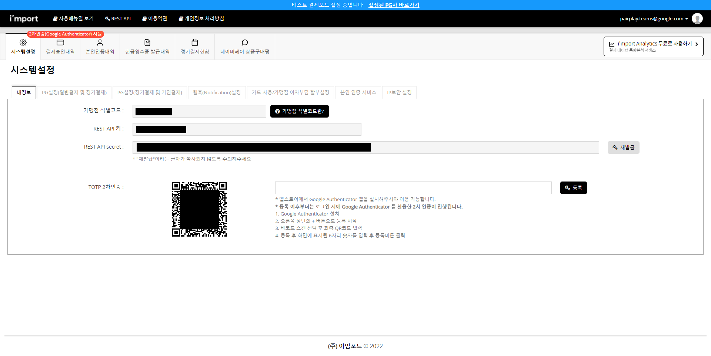
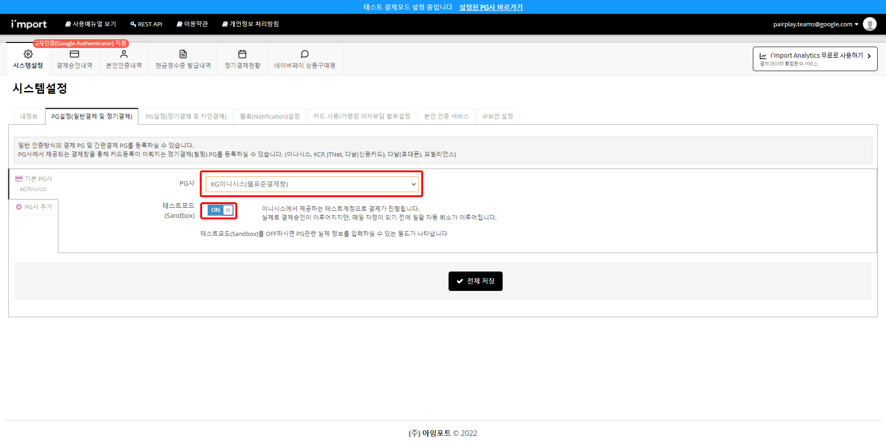

# Naver Map API

- Web Dynamic Map을 통해 줌인 아웃, 패닝 등 인터랙티브한 동적 지도 활용
- 필터링을 통한 원하는 운동 카테고리에 맞는 체육 시설의 위치 정보 제공
- 사용전 네이버 클라우드 플랫폼에서 어플리케이션 등록
  - https://www.ncloud.com/product/applicationService/maps
  - Maps의 web Dynamic Map 신청
  - 서비스 환경 등록에서 web 서비스 URL 등록
    - https://pairplay.site/
  - 발급된 Application Key 중 Client ID 사용
- 지도 API 사용 시, 해당 Vue 라이브러리를 활용 https://dongkyuuuu.github.io/vue3-naver-maps/
- https://navermaps.github.io/maps.js.ncp/docs/index.html

<br/>

<br/>

<br/>

# Daum 우편번호 서비스

- 현재 사용자 주소를 기반으로 장소 및 메이트 추천
- 주소를 기입하기 위한 Daum Postcode(우편번호 서비스) 사용
- 도로명 주소에서 원하는 시도 및 군구를 통한 필터링 조회
- https://postcode.map.daum.net/guide

<br/>

<br/>

<br/>

# S3(Simple Storage Service)

- AWS에서 제공하는 객체 스토리지 서비스

- 서비스 과정에서 사용되는 프로필 이미지 파일들을 업로드 하여 관리하기 위해서 사용

<br/>

### 1. AWS S3 bucket 생성
``` yml
  1. [AWS -> S3 -> 버킷 만들기]에서 새로운 버킷을 만든다.
  2. 퍼블릭 액세스를 허용해준다.
  3. 권한 -> 버킷 정책으로 들어가서 정책을 설정한다.
  
  {
      "Version": "2012-10-17",
      "Id": "Policy1644805559372",
      "Statement": [
          {
              "Sid": "Stmt1644805556206",
              "Effect": "Allow",
              "Principal": "*",
              "Action": [
                  "s3:GetObject",
                  "s3:PutObject"
              ],
              "Resource": "arn:aws:s3:::[버킷 이름]/*"
          }
      ]
  } 
```

<br/>

### 2. AWS IAM 사용자 생성
```Text
  AWS 액세스 유형 : 프로그래밍 방식 액세스

  권한 설정 : AmazonS3FullAccess 선택

  AccessKey와 Secret Key 저장
```

<br/>

### 3.  build.gradle에 의존성 추가
```gradle
	implementation("org.springframework.cloud:spring-cloud-starter-aws:2.2.6.RELEASE")
	implementation("io.awspring.cloud:spring-cloud-aws-context:2.3.3")
	implementation("org.springframework.cloud:spring-cloud-aws-autoconfigure:2.2.6.RELEASE")
```

<br/>

### 4. application.properties or yml 설정
```yaml
    # AWS S3 Cloud key
    cloud.aws.credentials.accessKey=<accessKey>
    cloud.aws.credentials.secretKey=<secretKey>
    cloud.aws.stack.auto=false

    # AWS S3 Service bucket
    cloud.aws.s3.bucket=pairplayteams
    cloud.aws.region.static=ap-northeast-2

    # AWS S3 Bucket URL
    cloud.aws.s3.bucket.url=<Bucket URL>

    # local Test disable AmazonClientException
    logging.level.com.amazonaws.util.EC2MetadataUtils=error
```

<br/>

### 5. s3 config 파일 추가
```java
    public class AmazonS3Config {
        @Value("${cloud.aws.credentials.access-key}")
        private String accessKey;

        @Value("${cloud.aws.credentials.secret-key}")
        private String secretKey;

        @Value("${cloud.aws.region.static}")
        private String region;

        @Bean
        public AmazonS3Client amazonS3Client() {
            BasicAWSCredentials awsCreds = new BasicAWSCredentials(accessKey, secretKey);
            return (AmazonS3Client) AmazonS3ClientBuilder.standard()
                    .withRegion(region)
                    .withCredentials(new AWSStaticCredentialsProvider(awsCreds))
                    .build();
        }
    }
```

<br/>

### 6. S3 service 클래스 추가

```java
    public class S3FileUploadService {

        // 버킷 이름 동적 할당
        @Value("${cloud.aws.s3.bucket}")
        private String bucket;

        // 버킷 주소 동적 할당
        @Value("${cloud.aws.s3.bucket.url}")
        private String defaultUrl;

        private final AmazonS3Client amazonS3Client;

        public String upload(MultipartFile uploadFile) throws IOException {
            String origName = uploadFile.getOriginalFilename();
            String fileName;
            try {
                // 확장자를 찾기 위한 코드
                final String ext = origName.substring(origName.lastIndexOf('.'));
                // 파일이름 암호화
                final String saveFileName = getUuid() + ext;
                // 파일 객체 생성
                // System.getProperty => 시스템 환경에 관한 정보를 얻을 수 있다. (user.dir = 현재 작업 디렉토리를 의미함)
                File file = new File(System.getProperty("user.dir") + saveFileName);
                // 파일 변환
                uploadFile.transferTo(file);
                // S3 파일 업로드
                uploadOnS3(saveFileName, file);
                // 주소 할당
                fileName = saveFileName;
                // 파일 삭제
                file.delete();
            } catch (StringIndexOutOfBoundsException e) {
                fileName = null;
            }
            return fileName;
        }

        public void deleteFile(String fileName) {
            amazonS3Client.deleteObject(new DeleteObjectRequest(bucket, fileName));
        }

        private static String getUuid() {
            return UUID.randomUUID().toString().replaceAll("-", "");
        }

        private void uploadOnS3(final String findName, final File file) {
            // AWS S3 전송 객체 생성
            final TransferManager transferManager = new TransferManager(this.amazonS3Client);
            // 요청 객체 생성
            final PutObjectRequest request = new PutObjectRequest(bucket, findName, file);
            // 업로드 시도
            final Upload upload = transferManager.upload(request);

            try {
                upload.waitForCompletion();
            } catch (AmazonClientException amazonClientException) {
                log.error(amazonClientException.getMessage());
            } catch (InterruptedException e) {
                log.error(e.getMessage());
            }
        }

        public String findImg(String img) {
            String imgPath = amazonS3Client.getUrl(bucket, img).toString();
            System.out.println(imgPath);
            log.info(imgPath);
            return imgPath;
        }

    }
```

<br/>
<br/>
<br/>

# 아임포트(i'mport)

## PG(Payment gateway)
- 온라인 결제의 경우 PG사와의 계약을 통해 전자결제서비스를 구축해야만 거래가 가능하다. 
- PG사는 신용카드사와 직접 계약하기 어려운 온라인 사이트를 대신해 결제와 정산 업무를 대행해 주는 업체를 뜻한다.
- PG사와 계약을 하면, 카드결제, 휴대폰 결제, 계좌이체, 무통장입금 등 다양한 결제 수단을 사이트 방문 고객에게 제공할 수 있다.
- 국내 PG결제 연동을 쉽게해주는 결제 API서비스로 PG사 결제모듈에 대한 연동 개발을 진행할 때, 다양한 개발환경에서 보다 쉽고 빠르게 개발할 수 있게 도와준다.
- 테스트 모드로 구동할 시 사업자 등록을 안해도 결제 시스템이 작동하며, 실제로 결제된 금액은 매일 자정에 환불된다.
- Pairplay 서비스의 체육 시설 예약시 실제 결제 시스템을 연동하기 위하여 사용했다.

<br/>

### 1. i'mport 회원가입 후 관리자콘솔로 로그인

<br/>

### 2. 가맹점 식별코드를 코드에 추가


<br/>

### 3. 원하는 PG사를 선택 후 테스트모드 ON


<br/>

### 4. jQuery와 import 모듈을 CDN 방식으로 다운
```javascript
    <!-- jQuery -->
    <script type="text/javascript" src="https://code.jquery.com/jquery-1.12.4.min.js" ></script>
    <!-- iamport.payment.js -->
    <script type="text/javascript" src="https://cdn.iamport.kr/js/iamport.payment-1.1.8.js"></script>
```

<br/>

### 5. 다음 코드를 결제 UI/UX와 연동
```javascript
  IMP.init('iamport'); //iamport 대신 자신의 "가맹점 식별코드"를 사용
  IMP.request_pay({
    pg: "inicis",
    pay_method: "card",
    merchant_uid : 'merchant_' + new Date().getTime(),
    name : '결제테스트', // 결제명
    amount : 14000, // 금액
    buyer_email : 'iamport@siot.do', // 구매자 메일
    buyer_name : '구매자', // 구매자 성명
    buyer_tel : '010-1234-5678', // 구매자 전화번호
    buyer_addr : '서울특별시 강남구 삼성동', // 구매자 주소
    buyer_postcode : '123-456'
  }, function (rsp) { // callback
      if (rsp.success) {
        // 결제 성공 시 로직,
      } else {
        // 결제 실패 시 로직,
      }
  });
```